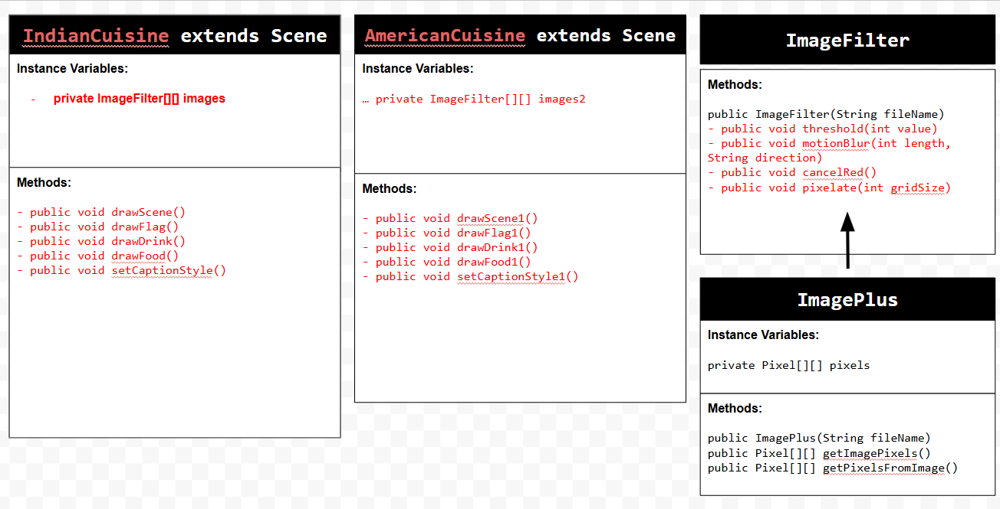
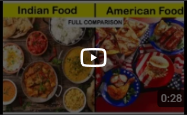

# Unit 5 - Personal Narrative / Interest Animation

## Introduction

Images are often used to portray our personal experiences and interests. We also use image filters and effects to change or enhance the mood of an image. When combined into collages and presentations, these images tell a story about who we are and what is important to us. Your goal is to create an animation using The Theater and Scene API that consists of images of your personal experiences and/or interests. In this animation, you will incorporate data related to these experiences and/or interests that can be organized in a 2D array, and use image filters and effects to change or enhance the mood of your images.
## Requirements

Use your knowledge of object-oriented programming, two-dimensional (2D) arrays, and algorithms to create your personal narrative collage or animation:
- **Write Scene subclasses** – Create two Scene subclasses: either two core parts of your personal life, or two components of a personal interest. Each class must contain a constructor and private instance variable with data related to the scene
- **Create at least two 2D arrays** – Create at least two 2D arrays to store the data that will make up your visualization.
Implement algorithms – Implement one or more algorithms that use loops and logic that operate on the data in your 2D arrays.
- **Create a visualization** – Create an animation that conveys the story of the data by illustrating the patterns or relationships in the data.
- **Image Filters** – Utilize the image filters created in this unit (and possible new filters) that show a personal flare to the images used in your animation.
- **Document your code** – Use comments to explain the purpose of the methods and code segments and note any preconditions and postconditions.

## UML Diagram

Put an image of your UML Diagram here. Upload the image of your UML Diagram to your repository, then use the Markdown syntax to insert your image here. Make sure your image file name is one work, otherwise it might not properly get displayed on this README.

## Video

Record a short video of your story to display here on your README. You can do this by:

- Screen record your project running on Code.org.
- Upload that recording to YouTube.
- Take a thumbnail for your image.
- Upload the thumbnail image to your repo.
- Use the following markdown
- ADDED BY DIVYA: MY AUDIO ISN'T WORKING AND I TRIED FOR AN HOUR TO FIX IT BUT ON CODE.ORG IT WORKS SO PLEASE CHECK THAT! 

## Story Description

Write a description of the story that your animation showcases. Give additional context for your story here in the case your animation is more abstract and only has images and little text. Lastly, include what data in your project is represented in 2D arrays and how those directly relate to the story your animation showcases.

- My animation tells the story of my connection to both Indian and American cuisine by showing the flags, drinks, and foods that represent each culture. Each scene uses images, text captions, audio, and image filters to highlight my favorite items and show both cuisines are important to me. The animation plays music in the bakcground while the images appear first in their original form and then with the filter applied. The data in my project is stored in the two 2D arrays of ImageFilter objects. Each row represents a category (flag, drinks, food) and each column represents different images in that category. This structure allows the program to loop through the images and display them in an organized way that matches the story of the two cuisines. 

## Image Filter Analysis

Choose at least 2 filters used in your animation to explain how the pixels are modified. If you created a new image filter that was not one of the ones from this unit, make sure to explain and analyze that filter(s) before choosing ones that came from this unit.
- One filter in my project is the pixelate filter, which divides the image into square sections based on a grid size. It also calculates the average red, green, and blue values for all pixels in each section then sets every pixel in that section to the average color. This reduces detail and created that blocky effect by directly modyfying the RGB values in the 2D pixel array. Another filter used was the motion blur filter. This averages the RGB values of a sequence of neighboring pixels in a chosen direction for a certain length. It keeps track of the number of pixels sampled then takes that color and assigns that color to the current pixel which gives a blurred motion effect. Both filters work by accessing the 2D array of pixels and changing their RGB to create that visible effect for my project.
